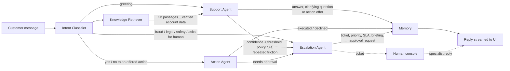

# Relay — agentic customer support that knows when to hand off

Relay is an end-to-end AI customer-support product built with **Python, LangGraph, FastAPI and Next.js**.
Five cooperating agents answer customers using a company knowledge base (RAG) and live order data, **take real
actions** (cancel orders, start returns) with the customer's consent, reply in the customer's language, score their
own confidence, and escalate to a human specialist — with a briefing, a suggested reply and one-click approvals —
whenever policy or uncertainty requires it.

The demo company is **Aurora Outfitters**, a fictional outdoor-gear retailer with mock customers, orders and help-center articles.

| Surface | URL | For |
| --- | --- | --- |
| Marketing site + chat widget | `http://localhost:3000/` | Prospects / storefront visitors |
| Live demo with agent trace | `/demo` | Seeing every agent decision in real time |
| Agent console | `/console` | Specialists: queue, approvals, copilot, macros |
| Knowledge base manager | `/knowledge` | Articles, knowledge gaps, AI article drafts, retrieval testing |
| Analytics | `/analytics` | Pulse (emerging issues), at-risk customers, ROI, SLA, automation, languages, CSAT, CSV export |
| Test Lab | `/evals` | Regression tests for the AI agent: scripted conversations + expected decisions, run in a sandbox |
| Settings | `/settings` | Branding, AI policies, widget install, webhooks & Slack, macros |
| Embeddable widget | `/widget.js`, `/embed`, `/widget-demo.html` | Any website, one `<script>` tag |

## What makes it a product

| Feature | What it does |
| --- | --- |
| **Agentic actions** | The Support Agent offers in-policy actions ("I can cancel ORD-10460 now — reply yes"). The **Action Agent** re-checks ownership and policy, executes on confirmation, and records an audit trail. Refunds above the approval limit or outside the window become **Approve / Deny** cards on the ticket; approving executes the refund, notifies the customer in their chat and resolves the ticket. |
| **Multilingual** | Language detection on every message (13 languages; offline stop-word + script detection, model-reported in LLM mode). Retrieval runs on an English rewrite; replies, handoffs and action confirmations are localized. Offline mode routes Spanish/French/German/Portuguese requests and adds a localized notice. |
| **Self-improving knowledge base** | In-scope questions the help center couldn't answer are flagged as knowledge gaps and clustered by topic. One click drafts an article from a cluster or from how a specialist resolved a ticket — with emails, order numbers, phone numbers and greetings redacted. |
| **Specialist copilot & macros** | Rewrite a reply friendlier / shorter / more formal / more empathetic, fix grammar, or translate into the customer's language. Macros insert saved replies with `{first_name}`, `{order_id}`, `{ticket_id}`, `{agent_name}`, `{company_name}` filled in. |
| **Workspace settings** | Company and assistant name, accent colour (re-tints the widget live), welcome message, suggested prompts, confidence threshold, refund limit, friction limit, action/multilingual toggles and ROI assumptions — stored in the database and applied without a restart. |
| **One-line widget** | `<script src="https://your-app/widget.js" async></script>` adds a themed launcher and iframe chat to any site (`data-position`, `data-open`, `window.Relay.open()`). |
| **Webhooks & Slack** | `ticket.created`, `ticket.resolved`, `action.approval_requested`, `action.completed`, `sla.breached`, `feedback.negative`, `insight.spike`. Generic endpoints are signed (`X-Relay-Signature: sha256=HMAC(secret, "<timestamp>.<body>")`); Slack endpoints get formatted messages. A background monitor fires SLA breaches once per ticket. Delivery log in Settings. |
| **ROI & SLA analytics** | Estimated agent hours and cost saved, automated vs. approved actions, SLA compliance, first-response and resolution time, language mix, and CSV exports (formula-injection safe). |
| **Guardrails** | Prompt-injection / off-topic requests never reach the model; policy overrides never leak the model's overridden draft to the customer. |
| **Test Lab** | Regression tests for the agent. A scenario is a scripted customer conversation plus expectations about the final reply (intent, escalate or not, escalation reason, action offered/executed/queued, language, knowledge gap, minimum confidence, phrases it must / must never say). Runs replay scenarios through the real graph in a **sandbox**: orders are pristine and changes stay in memory, sandbox tickets/messages/actions/agent memory are deleted afterwards, nothing appears in the console and no webhook fires. 12 built-in scenarios cover the demo script and guardrails; **Save as test** in the console freezes any real conversation into a scenario. Live progress, per-check diffs, transcripts and pass-rate history. Run it after changing a policy, an article or the model. |
| **Pulse** | Early warning for emerging issues: compares the last 24h with the previous 7 days and flags surging topics (intents), negative sentiment and escalations to a team — with a sparkline, the multiplier over baseline and example questions. Fires an `insight.spike` webhook (Slack-formatted) once per issue per day. |
| **Customer health** | An explainable 0–100 churn-risk score per customer (repeat contacts, escalations, open tickets, missed SLAs, angry/frustrated turns, low CSAT, denied requests, returns; happy ratings add back). Shown on every conversation in the console with the top reasons, and as an at-risk list with lifetime value at risk in Analytics. |

### Production operations

| Feature | What it does |
| --- | --- |
| **Observability** | Every request gets an `X-Request-ID` (yours if you send a sane one), echoed back and stamped on every log line, including the agents' model calls, so one ID traces a whole turn. `RELAY_LOG_FORMAT=json` emits one JSON object per line. `GET /metrics` serves Prometheus metrics: request rate and latency per route template, **per-agent-node latency**, turn outcomes, LLM calls/tokens/circuit state, webhook attempts and outbox depth, PII redactions, live consoles. Each trace step also carries its `duration_ms`. |
| **Health probes** | `GET /api/health/live` (process up) and `GET /api/health/ready` (database, agent memory and knowledge base each probed with latency; **503** if any fails). The LLM is reported but never fails readiness, because Relay still answers on the offline engine. |
| **LLM circuit breaker** | After `RELAY_LLM_CIRCUIT_FAILURE_THRESHOLD` consecutive provider failures, the model is skipped for the cooldown, so customers get an instant offline answer instead of waiting out timeouts and retries during an outage. Then one trial call is let through (half-open); success closes the circuit. |
| **Token & cost accounting** | Tokens from every model call are summed per turn into the reply's `meta.usage`, and totalled in analytics (`llm_usage`: calls, tokens, cost, cost per conversation). Set your model's prices with `RELAY_LLM_*_COST_PER_MTOK`; until then cost is reported as unknown, not $0. |
| **PII redaction** | Card numbers (Luhn plus network prefix), SSNs, CVVs, one-time codes, PINs and password-looking values are masked **before** the message is stored, shown to specialists, written to agent memory or sent to a model. The customer sees their masked message and a short notice. |
| **Privacy requests & retention** | Export everything held about a customer as JSON (access request), or erase it: message text, ticket notes and action details are wiped, the customer link removed and agent memory deleted, while non-personal facts (intent, confidence, outcome) keep analytics truthful. `RELAY_RETENTION_DAYS` applies the same anonymization automatically to closed conversations, never to open escalations. |
| **Tamper-evident audit log** | Settings changes (with before/after), approvals and denials, ticket edits and replies, KB edits, macros, webhooks, team changes, sign-ins (including failures), exports, erasures and retention runs. Each entry records the actor, IP and request ID and is **hash-chained** to the previous one; `GET /api/admin/audit/verify` pinpoints the first edited, removed or reordered entry. |
| **Durable webhooks** | Events go to an outbox first, then are delivered. Failures retry with exponential backoff and jitter (30 s → 24 h) from a background worker, survive restarts, and are dead-lettered after `RELAY_WEBHOOK_MAX_ATTEMPTS`, with one-click replay. The envelope `id` is stable across attempts (dedupe on it); `X-Relay-Attempt` and `X-Relay-Delivery` headers identify the try. |
| **SSRF protection** | Webhook URLs pointing at loopback, private, link-local (e.g. cloud metadata `169.254.169.254`) or `.internal` hosts are refused when saved, and the resolved IPs are checked again on every delivery, with redirects disabled. |
| **Idempotency keys** | `POST /api/chat` accepts `Idempotency-Key`: a retried request replays the stored response (`Idempotent-Replayed: true`) instead of sending the message twice; reusing a key with a different body is a 422, and one still in progress a 409. |
| **Rate-limit headers & hardening** | The chat limit advertises `RateLimit-Limit/Remaining/Reset` and `Retry-After` on 429. `RELAY_TRUST_PROXY_HEADERS` takes the client IP from `X-Forwarded-For` behind your proxy. Responses carry `nosniff`, `no-referrer` and `X-Frame-Options`, console responses are `no-store`, and HSTS is opt-in. |

---

## Architecture



| Agent | What it does | File |
| --- | --- | --- |
| **Intent Classifier** | 13-intent taxonomy, sentiment, urgency, entity extraction (order IDs, emails), follow-up rewriting, deterministic hard triggers | `backend/app/agents/intent_classifier.py` |
| **Knowledge Retriever** | Hybrid BM25 + TF-IDF retrieval (reciprocal-rank fusion, calibrated 0–1 relevance) over markdown articles; order/account lookup with ownership checks and email verification for guests | `backend/app/agents/knowledge_retriever.py`, `backend/app/rag/`, `backend/app/agents/context.py` |
| **Support Agent** | Grounded reply in the customer's language (LLM structured output or offline engine), scope and business-policy guardrails, blended confidence score, action offers, knowledge-gap flag, escalation decision | `backend/app/agents/support_agent.py` |
| **Action Agent** | Executes a confirmed action after re-checking ownership and policy; hands over-limit actions to approval | `backend/app/agents/action_agent.py`, `backend/app/actions.py` |
| **Escalation Agent** | Reason → team routing, priority (bumped for VIP / angry customers), SLA, briefing + suggested reply, ticket creation, refund approval request, webhook, localized handoff message | `backend/app/agents/escalation_agent.py` |
| Memory manager | Entity memory (orders, verified email, last intent) + rolling summary of older turns; LangGraph SQLite checkpointer per conversation | `backend/app/agents/memory.py` |

### Confidence scoring

```
confidence = 0.20·intent + 0.35·evidence + 0.45·generation − sentiment_penalty
evidence   = max(knowledge_base_relevance, order_data_grounding)
```

* Below `RELAY_CONFIDENCE_THRESHOLD` (default 0.6) an answer is **not sent**; the Escalation Agent takes over.
* Clarifying questions get a 0.65 floor (asking for an order number is always safe).
* Two consecutive borderline or frustrated turns escalate (`repeated_friction`).
* Hard triggers (fraud, chargebacks/legal, injury, explicit human request) bypass scoring entirely.

### Escalation policies (enforced even if the LLM disagrees)

| Trigger | Team | Base priority |
| --- | --- | --- |
| Unauthorized charge / account compromise | Trust & Safety | Urgent |
| Injury or safety hazard | Product Safety | Urgent |
| Chargeback, dispute, legal threat | Billing | High |
| Damaged / defective / wrong item (order identified) | Returns | High |
| Delayed shipment with no carrier scan ≥ 5 days | Orders & Shipping | High |
| Marked delivered but not received | Orders & Shipping | High |
| Refund above `RELAY_REFUND_APPROVAL_LIMIT` ($250) or outside window | Returns | Normal |
| Low confidence / complaint / asked for a human | General / CX | Normal |

Priority is raised one level for Aurora+ / high-value customers, angry sentiment, or urgent requests.

### Two engines, one workflow

* **LLM mode** — set `ANTHROPIC_API_KEY` (default model `claude-sonnet-5`) or `OPENAI_API_KEY` (default model `gpt-4o-mini`).
  Classifier, Support Agent, Escalation briefings and memory summaries use structured outputs (OpenAI strict JSON schema).
  Run `python -m app.llm_check` to verify your key and model with a few small live calls.
* **Offline mode** — no key required. A deterministic keyword classifier and extractive, data-grounded response engine run
  the same graph. It is also the automatic fallback if a provider call fails, so the product degrades gracefully.

The UI shows which engine is active in the top bar.

---

## Quick start

Requirements: **Python 3.11+** and **Node.js 20+**.

### 1. Backend (FastAPI + LangGraph) — port 8000

```bash
cd backend
python -m venv .venv
# Windows:      .venv\Scripts\activate
# macOS/Linux:  source .venv/bin/activate
pip install -r requirements.txt
cp .env.example .env          # optional: add ANTHROPIC_API_KEY or OPENAI_API_KEY
uvicorn app.main:app --reload --port 8000
```

Optional — fill the console and analytics with realistic demo conversations:

```bash
python -m app.seed
```

### 2. Frontend (Next.js 16) — port 3000

```bash
cd frontend
npm install
cp .env.example .env.local    # NEXT_PUBLIC_API_URL=http://localhost:8000
npm run dev
```

Open http://localhost:3000.

### Docker

```bash
docker compose up --build
```

---

## Try these in the live demo

| Signed in as | Say | What you'll see |
| --- | --- | --- |
| Maya Chen | "Where is my order?" | Auto-selects her only active order, tracking + ETA |
| Maya Chen | then "Can I return the down jacket?" → **Yes** | Matches the jacket to a *different* order, offers to start the return, creates an RMA |
| Sam Okafor | "Please cancel my order" → **Yes** | Action Agent cancels ORD-10460 and confirms the released authorization |
| Maya Chen | "¿Dónde está mi pedido?" | Spanish detected; order status (localized fully in LLM mode) |
| Guest | "What's the status of ORD-10397?" → `jordan.alvarez@example.com` | Email verification, then delayed-shipment policy escalation |
| Priya Raman | "I want a refund for ORD-10350" | Refund over $250 → Returns ticket (VIP bump) with an **Approve / Deny** card in `/console` |
| Jordan Alvarez | "Do you sell bicycles?" | Declined politely and logged as a knowledge gap in `/knowledge` |
| Elena Rossi | "My order arrived damaged" → `ORD-10433` | Clarify, then damaged-item escalation |
| Jordan Alvarez | "There's an unauthorized charge on my card" | Hard trigger → Urgent Trust & Safety ticket |
| Anyone | "Talk to a human" | Handoff; reply from `/console` appears in the chat |
| Anyone | "What's the capital of France?" | Polite out-of-scope decline, no wasted ticket |

Demo data lives in `backend/data/customers.json` and `backend/data/orders.json` (dates are relative to 2026-09-15).
Actions change orders through a persisted overlay; **Reset demo orders** on `/demo` (or `POST /api/admin/demo/reset-orders`) restores them.

---

## Knowledge base

Articles are markdown files in `backend/knowledge_base/`, with front matter:

```markdown
---
title: Shipping & Delivery
category: shipping
---

# Shipping & Delivery

## Where we ship
We ship to all 50 US states, ...
```

Each `##` section becomes one retrievable chunk; `category` boosts retrieval for matching intents. Edit articles in
`/knowledge` (changes are re-indexed instantly) or directly on disk and restart. Included articles: shipping, returns & refunds,
billing, account & membership, products & warranty, orders & cancellations, support policy.

---

## API

Public (customer-facing):

| Method | Path | Description |
| --- | --- | --- |
| `POST` | `/api/chat/stream` | Send a message; Server-Sent Events: `conversation`, `customer_message`, `step` (one per agent), `message`, `done` |
| `POST` | `/api/chat` | Same, as a single JSON response |
| `GET` | `/api/conversations/{id}` | Transcript + open ticket |
| `GET` | `/api/conversations/{id}/messages?after_id=` | Poll for specialist replies |
| `POST` | `/api/conversations/{id}/feedback` | CSAT rating 1–5 |
| `GET` | `/api/config`, `/api/health` | Branding, engine, KB stats, LLM circuit state |
| `GET` | `/api/health/live` · `/api/health/ready` | Liveness · readiness probes (503 when a dependency is down) |
| `GET` | `/metrics` | Prometheus metrics (`Authorization: Bearer <RELAY_METRICS_TOKEN>` when set) |
| `GET` | `/api/demo/customers` | Demo identities (remove in production) |

Admin (require `X-Admin-Key` when `RELAY_ADMIN_API_KEY` is set):

| Method | Path | Description |
| --- | --- | --- |
| `GET` | `/api/admin/tickets[?status=]` | Queue, sorted by priority then age |
| `GET` | `/api/admin/tickets/{id}` | Ticket + transcript + customer + agent memory |
| `POST` | `/api/admin/tickets/{id}/reply` | Specialist reply (optionally resolve); injected into agent memory |
| `PATCH` | `/api/admin/tickets/{id}` | Status / priority / assignee |
| `GET` | `/api/admin/conversations[/{id}]` | All conversations, memory inspection |
| `GET` | `/api/admin/analytics` | KPIs and distributions |
| `GET/POST/PUT/DELETE` | `/api/admin/kb/documents[/{id}]` | Knowledge base CRUD (re-indexes) |
| `POST` | `/api/admin/kb/search` | Retrieval playground |
| `GET/PATCH` | `/api/admin/settings` | Workspace branding, AI policies, ROI assumptions (validated, applied live) |
| `GET` | `/api/admin/actions[?status=]` | Order actions (executed, pending approval, denied, failed) |
| `POST` | `/api/admin/actions/{id}/approve` · `/deny` | Execute or reject an approval request; notifies the customer |
| `GET/POST/PUT/DELETE` | `/api/admin/macros[/{id}]` | Saved replies |
| `POST` | `/api/admin/copilot/rewrite` | `friendlier` · `shorter` · `formal` · `empathetic` · `fix_grammar` · `translate` |
| `GET` | `/api/admin/insights/knowledge-gaps?days=30` | Clustered unanswered questions |
| `POST` | `/api/admin/kb/drafts` · `/api/admin/kb/drafts/ticket/{id}` | Article draft from questions or a resolved ticket (PII redacted) |
| `GET/POST/PATCH/DELETE` | `/api/admin/webhooks[/{id}]`, `POST …/{id}/test` | Endpoints, event catalog, delivery log |
| `POST` | `/api/admin/sla/check` | Run the SLA breach check now (also runs every 60s, with the Pulse spike check) |
| `GET` | `/api/admin/insights/pulse` | Emerging issues: last 24h vs. the 7-day baseline |
| `GET` | `/api/admin/insights/customer-health` · `/api/admin/customers/{id}/health` | At-risk customers · one customer's health score and factors |
| `GET` | `/api/admin/evals` | Test Lab: scenarios with their latest result, run history, catalog |
| `POST/PUT/DELETE` | `/api/admin/evals/scenarios[/{id}]` | Create / edit / delete scenarios (edit and delete need an admin) |
| `POST` | `/api/admin/evals/scenarios/from-conversation/{id}` | Save a real conversation as a regression test |
| `POST` | `/api/admin/evals/runs` | Run all or selected scenarios (`{"scenario_ids": [...], "wait": true}` blocks — handy in CI) |
| `GET` | `/api/admin/evals/runs/{id}` | A run with per-scenario checks and transcripts |
| `GET` | `/api/admin/export/tickets.csv` · `conversations.csv` | CSV exports |
| `GET` | `/api/admin/webhooks/outbox[?status=]` · `POST …/outbox/{id}/retry` | Delivery queue (pending, delivered, dead) · replay a delivery |
| `GET` | `/api/admin/audit?action=&actor=&target_type=&target_id=&before_id=` | Audit log (`action=action.*` matches a family; cursor pagination) |
| `GET` | `/api/admin/audit/verify` | Recompute the hash chain; reports the first tampered entry |
| `GET` | `/api/admin/customers/{id}/export` | Everything held about a customer, as a JSON download |
| `POST` | `/api/admin/customers/{id}/erase` · `/api/admin/conversations/{id}/erase` | Anonymize a customer's or one conversation's data (`{"confirm": "<id>"}`) |
| `POST` | `/api/admin/demo/reset-orders` | Undo demo cancellations, returns and refunds |

Interactive docs: http://localhost:8000/docs

---

## Project structure

```
backend/
  app/
    agents/            graph.py · state.py · intent_classifier.py · knowledge_retriever.py
                       support_agent.py · action_agent.py · escalation_agent.py · memory.py · context.py
                       confidence.py · signals.py · intents.py · offline_responder.py
    rag/               ingest.py (markdown → chunks) · retriever.py (hybrid BM25/TF-IDF)
    actions.py         order actions: policy checks, execution, approvals
    commerce.py        mock order/customer service + persisted order changes + policy logic
    i18n.py            language detection + localization
    insights.py        knowledge gaps + article drafts (PII redaction)
    copilot.py         specialist rewrite / translate
    webhooks.py        signed webhooks, Slack alerts, durable outbox with retries, SSRF guard, SLA monitor
    observability.py   request IDs, JSON logs, Prometheus metrics, security headers (ASGI middleware)
    audit.py           hash-chained audit log + verification
    privacy.py         PII redaction, data export / erasure, retention policy
    idempotency.py     Idempotency-Key handling for retry-safe writes
    reporting.py       ROI, SLA, automation metrics + CSV exports
    evals.py           Test Lab: scenarios, sandboxed runs, expectation checks
    pulse.py           emerging-issue detection + insight.spike alerts
    health.py          explainable customer health / churn-risk score
    workspace.py       runtime workspace settings
    db.py              SQLite: conversations, messages, tickets, actions, macros, webhooks, settings
    llm.py             provider resolution + structured calls with offline fallback
    main.py            FastAPI app (chat, console) · product_api.py (settings, actions, copilot, insights, webhooks)
    seed.py            demo data generator
  knowledge_base/      help-center articles (markdown)
  data/                customers.json · orders.json
  tests/               140 tests: retrieval, signals, flows, handoff, guardrails, actions, approvals,
                       settings, multilingual, knowledge gaps, copilot, macros, webhooks, SLA, reporting,
                       Test Lab sandboxing, Pulse, customer health, observability, circuit breaker,
                       PII redaction, privacy requests, audit chain, outbox retries, SSRF, idempotency
frontend/
  src/app/             / (landing) · (app)/demo · console · knowledge · analytics · evals · settings · embed
  src/components/      ChatPanel · ChatWidget · AgentTrace · AppShell · ...
  src/hooks/           useChat (SSE streaming, resumable conversations, handoff polling) · useAsync · useWorkspaceConfig
  src/lib/             api client · types · formatting · theme (runtime accent colour)
  public/              widget.js (embeddable launcher) · widget-demo.html (sample storefront)
```

## Tests

```bash
cd backend && pytest -q                    # runs fully offline
cd frontend && npx tsc --noEmit && npm run lint && npm run build
```

---

## Taking it to production

This repo is production-shaped, but a few seams are intentionally simple for a self-contained demo:

* **Identity** — the demo "Signed in as" switcher passes a `customer_id`. In production, derive it from your auth/session
  (signed JWT from the storefront) instead of trusting the client. Conversation IDs are unguessable but act as bearer tokens.
* **Admin auth** — set `RELAY_ADMIN_API_KEY`; for teams, put the console behind SSO.
* **Storage** — SQLite (app data + LangGraph checkpoints) is fine for a single instance. For scale, move to Postgres and
  `langgraph-checkpoint-postgres`.
* **Retrieval** — the lexical hybrid retriever is dependency-free and deterministic. `KnowledgeRetriever.search()` is the seam to
  swap in embeddings + a vector store (pgvector, Pinecone) for large knowledge bases.
* **Commerce data** — replace `app/commerce.py` with calls to Shopify / your OMS; the agents only use its functions.
* **Real-time** — specialist replies are delivered by 3-second polling; swap for WebSockets if needed.
* **Actions** — `app/actions.py` `_apply()` is the seam to call your OMS/payment provider (Shopify cancel, Stripe refund);
  the policy checks, confirmation flow, approvals and audit trail stay the same.
* **Webhooks** — private-network destinations are refused and deliveries are retried from a durable outbox. For defence in
  depth, still restrict egress at the network layer (the DNS check can't fully rule out rebinding between check and connect).
* **Audit log** — the hash chain detects edits, but someone with database write access could rebuild it; forward entries to
  append-only storage or your SIEM for stronger guarantees.
* **Access logs** — Relay writes its own access log with request IDs; run uvicorn with `--no-access-log` to avoid duplicates.
* **Widget identity** — `data-customer-id` is for demos; pass a signed session token from your backend instead.
* **Rate limiting** — in-memory per-IP (sliding window, standard headers); with several instances, use Redis or your gateway,
  and set `RELAY_TRUST_PROXY_HEADERS=true` behind your load balancer so limits apply per client, not per proxy.
